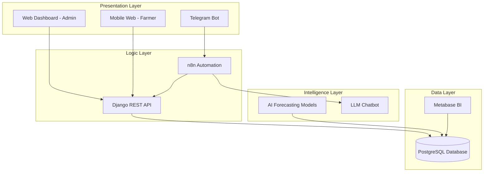

# 🌾 HỆ THỐNG QUẢN LÝ CHUỖI CUNG ỨNG NÔNG SẢN

> **Đề án tốt nghiệp:** Xây dựng hệ thống thông tin quản lý chuỗi cung ứng nông sản - Tích hợp AI dự báo thị trường, tự động hóa quy trình và chatbot hỗ trợ nông dân

[](https://www.postgresql.org/)
[](https://www.djangoproject.com/)
[](https://www.python.org/)
[](https://n8n.io/)

---

## 📋 Tổng Quan

### 🎯 Vấn Đề Giải Quyết

Nông nghiệp Việt Nam đang gặp hai vấn đề lớn:

1. **Mù mờ thông tin:** 
   - Doanh nghiệp thiếu dữ liệu thị trường để lập kế hoạch thu mua
   - Nông dân sản xuất tự phát → "được mùa mất giá"

2. **Thiếu hỗ trợ kỹ thuật:**
   - Nông dân thiếu công cụ giám sát quy trình canh tác chuẩn (VietGAP)
   - Chất lượng nông sản không đồng đều

### 💡 Giải Pháp

Nền tảng chuyển đổi số toàn diện kết hợp **Big Data**, **AI** và **Automation** để kết nối chặt chẽ giữa **Sản xuất** và **Tiêu thụ**.

---

## 🎯 Mục Tiêu

### Mục tiêu tổng quát
Xây dựng hệ thống hỗ trợ ra quyết định (DSS) khép kín:
```
Lập kế hoạch → Canh tác → Thu hoạch → Phân phối
```

### Mục tiêu cụ thể

- ✅ **Số hóa dữ liệu:** Quản lý tập trung vùng trồng, quy trình kỹ thuật, giá cả thị trường
- 🤖 **Dự báo thông minh:** AI dự báo nhu cầu tiêu thụ và khuyến nghị kế hoạch trồng trọt
- 💬 **Trợ lý ảo:** Chatbot AI hỗ trợ nông dân tra cứu kỹ thuật và giá cả
- 📅 **Hỗ trợ canh tác:** Timeline tự động hóa cho từng vụ mùa

---

## 🏗️ Kiến Trúc Hệ Thống



---

## 🔧 Tech Stack

| Thành phần | Công nghệ | Vai trò |
|-----------|-----------|---------|
| **Backend & API** | Python (Django) | Framework mạnh mẽ, bảo mật tốt, tích hợp Admin |
| **Database** | PostgreSQL 14+ | CSDL quan hệ, lưu trữ cấu trúc phức tạp |
| **Automation** | n8n | Workflow tự động, kết nối Telegram, Chatbot AI |
| **BI & Visualization** | Metabase | Dashboard phân tích, embed vào Web Admin |
| **AI & Data Science** | Pandas, Statsmodels | Xử lý dữ liệu, dự báo chuỗi thời gian (ARIMA) |
| **LLM Integration** | OpenAI API | Xử lý ngôn ngữ tự nhiên cho Chatbot |
| **Frontend** | Bootstrap 5, Chart.js | Giao diện responsive, tối ưu mobile |

---

## 📦 Các Phân Hệ Chức Năng

### 1️⃣ Phân Hệ Admin & Doanh Nghiệp (Web Portal)

**Mục tiêu:** Quản trị và ra quyết định chiến lược

- **Quản lý dữ liệu nền:**
  - Danh mục cây trồng, mùa vụ, vùng trồng
  - Quy trình kỹ thuật (Knowledge Base)
  - Template quy trình canh tác (VD: Dưa lưới 75 ngày)

- **Business Intelligence (BI Dashboard):**
  - Biểu đồ biến động giá và sản lượng
  - Heatmap vùng trồng
  - Theo dõi dịch bệnh

- **AI Engine:**
  - Dự báo nhu cầu thị trường 3 tháng tới
  - Gợi ý phân bổ: "Vùng A nên trồng cây X để tối ưu chi phí"

### 2️⃣ Phân Hệ Nông Dân (Mobile Web)

**Mục tiêu:** Trợ lý canh tác cầm tay

- **Nhận nhiệm vụ:** Xem khuyến nghị trồng cây từ HTX (kèm giá thu mua dự kiến)
- **Timeline Canh tác thông minh:**
  - Tự động sinh lịch trình công việc khi bắt đầu vụ mùa
  - To-do list hàng ngày: "Ngày 45: Bón thúc đợt 2 bằng phân NPK"
- **Nhật ký điện tử:** Tick hoàn thành công việc để báo cáo HTX

### 3️⃣ Phân Hệ Chatbot AI (n8n + Telegram)

**Mục tiêu:** Tư vấn hỏi đáp 24/7

- **Tra cứu giá:** "Giá ổi hôm nay?" → Truy vấn DB trả lời
- **Hỏi đáp kỹ thuật:** "Cây bị vàng lá chữa sao?" → AI tổng hợp từ knowledge base
- **Cảnh báo tự động:** Gửi tin nhắn khi có dự báo bão/sâu bệnh

---

## 📊 Database Schema

Hệ thống quản lý **30+ bảng** với các module chính:

- 👥 **Users & Roles:** Phân quyền admin, manager, farmer
- 🌍 **Địa điểm:** 63 tỉnh/thành, quận/huyện, xã/phường
- 🌱 **Cây trồng:** 20+ loại cây (Dưa lưới, Ổi, Cà chua, Xà lách...)
- 📋 **Quy trình kỹ thuật:** 6 quy trình chi tiết (75-120 ngày)
- 🏡 **Nông hộ & Vùng trồng:** HTX, farmers, farms
- 📅 **Vụ mùa:** Seasons, daily tasks, farming logs
- 💰 **Giá thị trường:** 30 ngày dữ liệu giá
- 🤖 **AI & Chatbot:** Forecasts, recommendations, chat logs
- ⚠️ **Cảnh báo:** Alerts, notifications

➡️ **Chi tiết:** [Database Documentation](./database/README.md)

---

## 🚀 Cài Đặt & Chạy

### Prerequisites

- PostgreSQL 14+
- Python 3.11+
- Node.js 18+ (cho n8n)
- Docker (optional)

### 1. Setup Database

```bash
# Tạo database
createdb agri_supply_chain

# Chạy schema (có thể chạy nhiều lần)
psql -d agri_supply_chain -f database/FULL_SETUP.sql
```

➡️ **Chi tiết:** [Database Setup Guide](./database/FULL_SETUP_README.md)

### 2. Setup Backend (Coming Soon)

```bash
# Clone repository
git clone https://github.com/HoangDLongg/HTKDTMN9.git
cd HTKDTMN9

# Install dependencies
pip install -r requirements.txt

# Run migrations
python manage.py migrate

# Start server
python manage.py runserver
```

### 3. Setup n8n Automation (Coming Soon)

```bash
# Install n8n
npm install -g n8n

# Start n8n
n8n start
```

---

## 📅 Kế Hoạch Triển Khai (10 Tuần)

### 🔹 Giai đoạn 1: Khởi tạo & Dữ liệu (Tuần 1-3)
- ✅ **Tuần 1:** Thiết kế Database (ERD) - **HOÀN THÀNH**
- ✅ **Tuần 2:** Cài đặt môi trường Dev - **HOÀN THÀNH**
- ⏳ **Tuần 3:** Cấu hình n8n workflow

### 🔹 Giai đoạn 2: Core System (Tuần 4-6)
- ⏳ **Tuần 4:** Xây dựng Django Admin
- ⏳ **Tuần 5:** Module AI Dự báo
- ⏳ **Tuần 6:** Triển khai Metabase BI

### 🔹 Giai đoạn 3: Ứng dụng & Chatbot (Tuần 7-9)
- ⏳ **Tuần 7:** Mobile Web cho Nông dân
- ⏳ **Tuần 8:** Chatbot trên n8n + Telegram
- ⏳ **Tuần 9:** Tích hợp API thời tiết

### 🔹 Giai đoạn 4: Hoàn thiện (Tuần 10)
- ⏳ Kiểm thử UAT
- ⏳ Viết báo cáo, quay video demo

---

## 🎓 Kết Quả Dự Kiến

### Sản phẩm
- ✅ Hệ thống phần mềm hoàn chỉnh (Web + Mobile)
- ✅ Chatbot thông minh qua Telegram
- ✅ Hệ thống BI & AI dự báo
- ✅ Cơ sở dữ liệu tri thức nông nghiệp

### Tính mới & Đóng góp
- 🆕 Tích hợp n8n (Automation) vào quy trình nghiệp vụ
- 🆕 Ứng dụng RAG (Retrieval-Augmented Generation) cho Chatbot
- 🆕 Giải quyết bài toán thực tế về quy hoạch chuỗi cung ứng

---

## 👥 Đối Tượng Phục Vụ

- 🏢 **Hợp tác xã (HTX)**
- 🏭 **Doanh nghiệp nông nghiệp**
- 👨‍🌾 **Hộ nông dân liên kết**

---

## 📞 Liên Hệ

**Sinh viên thực hiện:** [Tên của bạn]  
**MSSV:** [Mã số sinh viên]  
**Email:** [Email của bạn]  
**GitHub:** https://github.com/HoangDLongg/HTKDTMN9

---

## 📄 License

[Chọn license phù hợp - MIT, Apache 2.0, etc.]

---

**Ngày bắt đầu:** 2026-01-12  
**Trạng thái:** 🚧 Đang phát triển
